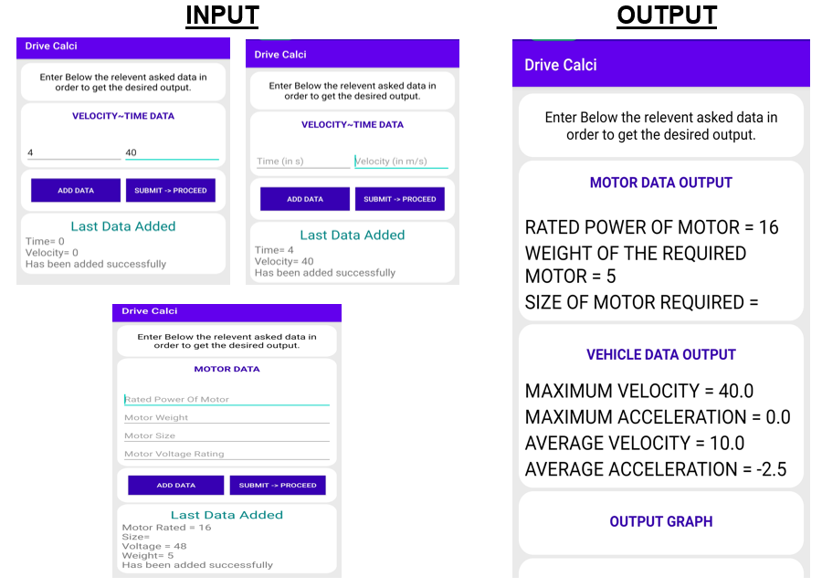

# DRIVE-CALCI
GUI based application , which can be used to find Powertrain Sizing of an Electric Vehicle by providing vehicle parameters and performance &amp; range requirement based on any drive cycle.

# Working
This drive calci works really smooth and in a very user friendly way it calculates the **Powertrain Sizing of Electric Vehicle**. It just takes few inputs in order to calculate the desired output:
 * Vehicle Data (such as Vehicle weights, Frontal Area, Wheel radius, drag coefficients.... etc.)
 * Velocity ~ Time Data
 * Available Motor Sizing Data

A video is attached here to see the working of app. [Watch Video](https://drive.google.com/file/d/1cyETdIqP_Ovo-pytUQpOFe6pMyQiNuD3/view)

# Screenshots

    

# Achievements and Awards
 * **1st Prize** in the **Vahan Hackathon** segment of the event **Autosparx 2021** organised by [SAE India](https://saeindia.org/) and [ARAI Academy](https://academy.araiindia.com/)

In this event their were more then 600 teams participating out of which our team won in the Vahan Hackathon segment. We recieved a cash prise of **Rs. 10,000** and guidance by ARAI Academy.

# Our Team
 * **Team Leader** : [Surbhi Suman (@surbhi-sola)](https://github.com/surbhi-sola) 
 * **App Developer** : [Tanay Kumar (@tanay388)](https://github.com/tanay388)
 * **Reserch Done By** : Yash Maheshwari & Anand Gopal
 * **Other Teammates** : Shivam Mishra & Sibten Raza
